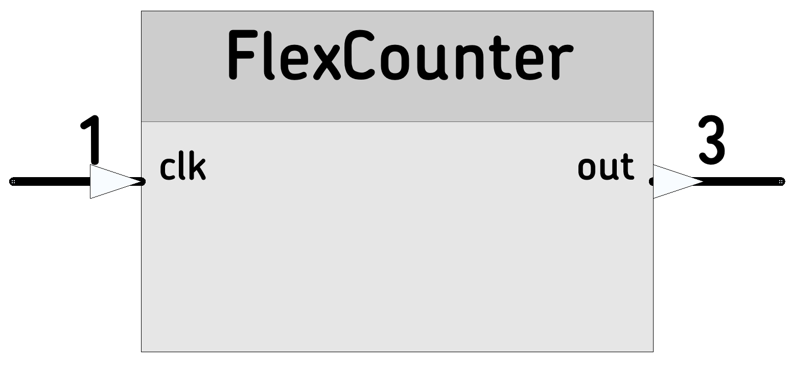

# [FlexCounter](https://github.com/nBlocksStudioNodes/nblocks_flexcounter)

This node is a Flexible Counter

----

----

 *  Category: Time
 *  HAL: mbed
 *  Status Definition: LPC1768
 *  Author: Nikolaos Chalikias

## Inputs/Outputs 
 *  (schematic pin 1) The 1st input is the Counter clock input, Its action depends on the Mode 
 *  (schematic pin 2) The Output is the actual Counter value.

## Parameters 
 *  uint32_t: maxValue: Maximum Counter Value
 *  uint32_t: minValue: Mimimum Counter Value
 *  uint32_t: step: The value the clock input increments or decrements the counter
 *  uint8_t:  Mode: 0 for UP , 1 for DOWN, 3 for UP/DOWN

## Example:

[Ticker]-->[Counter]-->[StringFormat]-->[StringSerial]

